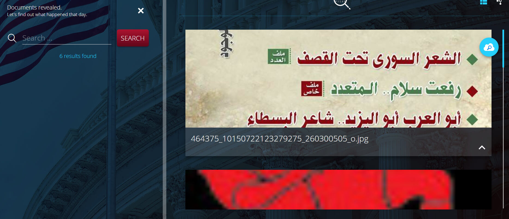
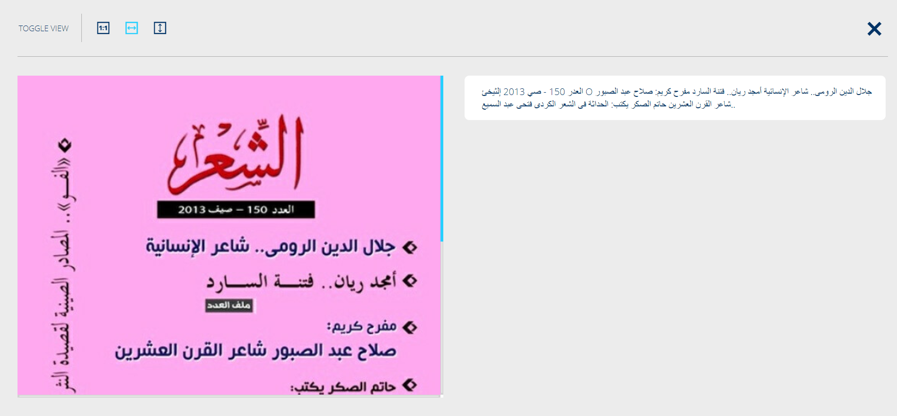
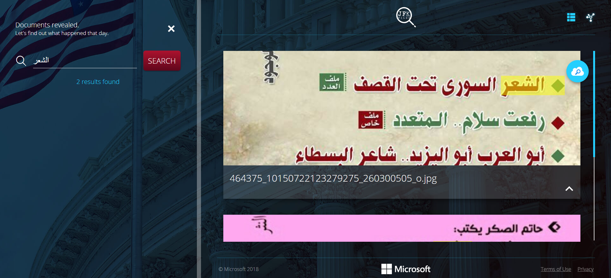

# Arabic-Azure-search
Trial for implementing Azure search in Arabic based on Azure JFK files demo
Trying out Azure search with Arabic OCR language support. 
Azure search can be provisioned to search for Arabic words in images. The best way to create this is to provision the components and parameters through REST API, this provides maximum control instead of the portal. 
Provisioning the search service creates an API which you can call with a specific text to search for and it will return the results. Results are displayed in json format with the recognized words and a bounding box. 

In order to view results with a UI, I leveraged the JFK files demo and replaced the search service parameters with my own. 

# Steps:
1-Deployed the environment locally to my subscription following the instructions :
            https://github.com/Microsoft/AISchoolTutorials/blob/master/jfkfiles/README.md
2-Ran the mentioned steps for configuring the environment
3-Replaced the created storage container with my sample images which have Arabic text
4-Replaced the container name in the app.config page to be the new container
5-Replaced the content of the files : “index.json”, “skillset.json”, “indexer.json”
6-Edited “HocrDocument.cs” in JfkWebAPISkills project to reverse the order of the result array to read right to left.
7-The json files skillset contain the parameters adjusted to recognize Arabic content and removed the skills which only support English
8-Removed the relevant code in “program.cs” which provisioned the unsupported skills
9-After deploying the website, you will be provided a link which you can view the search

Results initially display all of the Arabic documents created in the blob account and the extracted text. 
 
 

Extracted text is originally retrieved left to right, I adjusted this by reversing the json array coming from the azure search result in order to read right to left. 

 

After searching for a specific Arabic text, results will be filtered to view the documents and highlight the matching text with a yellow box. 

 

